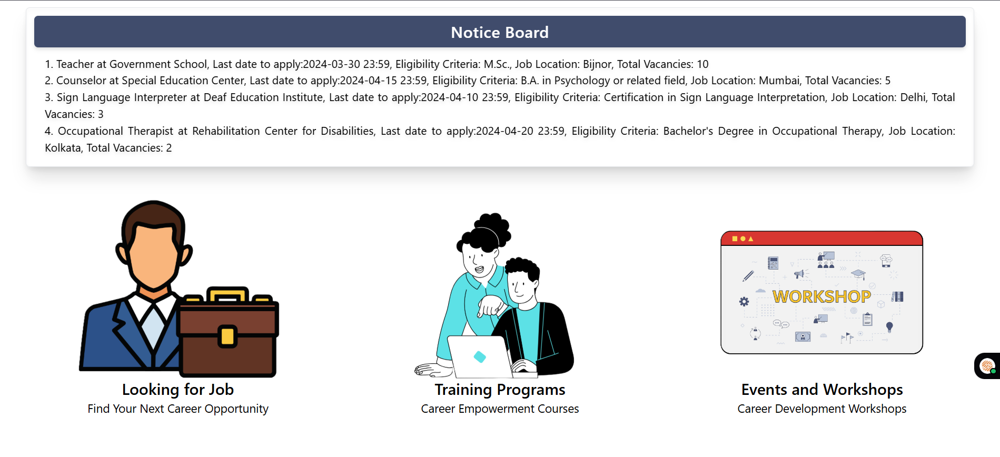
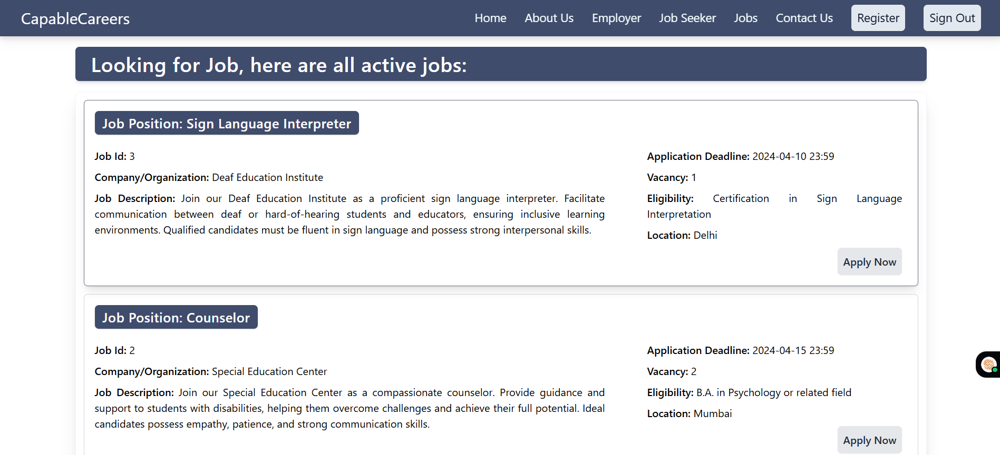

# 🌟 Capable Careers – Bridging Talent & Opportunity for India’s Specially-Abled

**Capable Careers** is an accessible job portal and upskilling platform built for persons with disabilities in India. Conceived at SIH 2023 to combat employment barriers, the project addresses under-representation, visibility issues, and lack of resources—laying the groundwork for a more inclusive workforce.

🔗 **[Live Demo](https://capablecareers.netlify.app/)**  
🔗 **[GitHub Repository](https://github.com/AkshatJain447/CapableCareers)**

---

## 🚩 The Problem

Despite progressive mandates reserving **4–5%** of government jobs for disabled individuals, less than half of these positions are filled in India. Barriers such as inaccessible information, limited resources, and community isolation keep **hundreds of thousands** of capable job seekers from meaningful work.

**Capable Careers** turns technology into access and opportunity.  
*Demo/sample data is showcased; the platform is architected to scale and impact 400,000–800,000+ specially-abled job-seekers nationwide.*

---

## 🚀 Feature Highlights

- 🧩 **Inclusive Job Portal**
  - Curated positions for differently-abled candidates
  - Role-based access: job seekers apply, employers post/manage openings
  - Personalized dashboards and application tracking

- ♿ **Accessibility First**
  - Screen reader and keyboard navigation support
  - Customizable, responsive UI themes
  - Future-ready foundation for voice commands and extended accessibility

- 📚 **Skills & Learning Hub**
  - 6+ targeted upskilling courses (YouTube linked)
  - Fast-track learning mapped to in-demand roles

- 👤 **Secure & Role-Based Access**
  - Firebase Authentication (Google & Email/Password)
  - Permissioned dashboard flow for job seekers and employers

- 📅 **Events & Resources**
  - Demo event listings for webinars, drives, and opportunities
  - Expanding hub for vital services: healthcare, education, legal aid

---

## 🛠️ Tech Stack

| Technology           | Role                                          |
|----------------------|-----------------------------------------------|
| **React.js**         | Modern, component-driven front end            |
| **Redux Toolkit**    | Scalable global state & user/session flows    |
| **Firebase Auth**    | Fast, secure authentication (OAuth/Email)     |
| **Cloud Firestore**  | Real-time NoSQL for jobs, users, contacts     |
| **Firebase Hosting** | CI/CD, blazing-fast static hosting            |
| **Tailwind CSS**     | Utility-first, accessible, mobile-first UI    |
| **React Icons**      | Consistent, inclusive iconography             |

---

## 📸 Screenshots

### 🏠 Home Page  

### 💼 Job Listings  

### 👤 Job Seeker Dashboard  

### 🏢 Employer Dashboard  

---

## 📈 Impact & Aspirations

- **Engineered for national scale:** Robust demo with architecture ready for 400,000–800,000+ users  
- **Tackling under-representation:** Increases job awareness, skill development, and workforce participation for the specially-abled  
- **Accessible by default:** Prioritizes inclusivity in every user interaction

---

## 🧑‍💻 Learnings & Achievements

- Modular React component architecture for rapid iterations
- Redux-enabled role and state management
- Prioritized accessibility and mobile responsiveness
- Deep Firebase integration (authentication, real-time data, hosting)
- Achieved **4th place at Hackfusion (NIT Hamirpur)**

---

## 🔮 Roadmap & Next Steps

- 🛠️ Admin dashboard for enterprise and system management
- 🤖 AI-powered, personalized job recommendations
- 🔒 API integrations (govt. document/disability verification)
- 🗣️ Voice command support & multilingual UI
- 📲 In-app notifications and live event features

---

## 👨‍💻 About the Developer

**Akshat Jain**  
Computer Science graduate; passionate about accessible, scalable web solutions  
Experienced in React, Node.js, MongoDB, Firebase, and clean UI practices  
✉️ CodingKnights447@gmail.com

---

## 🤝 Contributions & Collaboration

- Star/fork and submit pull requests: a11y, integration, training, and more
- Open to partnerships, mentorship, and new feature discussions

---

## 📄 License

MIT License — fully open for use and collaboration.

> 💪 *Capable Careers unlocks human potential. If you value accessible tech and authentic problem-solving, join the journey!*
