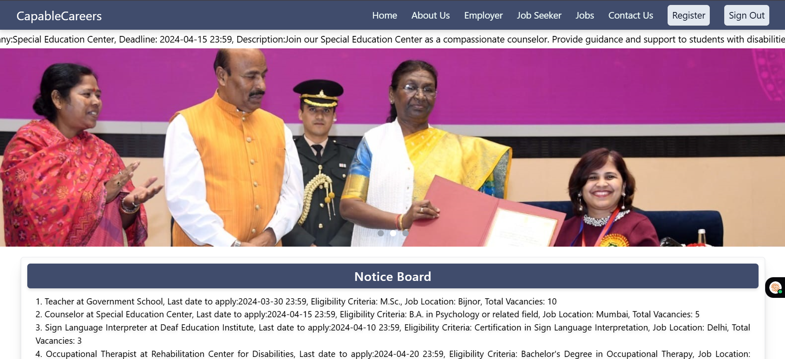
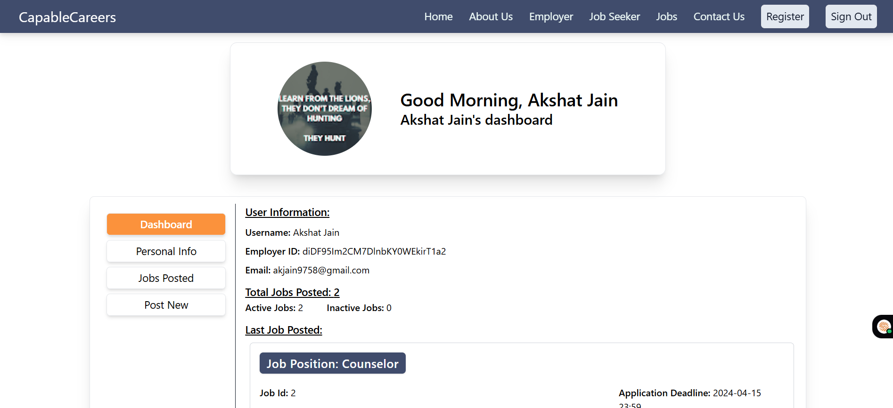

# 🌟 Capable Careers – Job Portal & Training Platform for Persons with Disabilities

**Capable Careers** is a job portal and training platform designed specifically for individuals with disabilities. Our mission is to bridge the employment gap by offering accessible job listings, skills training, community support, and essential resources tailored to their unique needs.

🔗 **Live Demo**: [capablecareers.netlify.app](https://capablecareers.netlify.app/)  
🔗 **GitHub Repo**: [CapableCareers Repository](https://github.com/AkshatJain447/CapableCareers)

---

## 🚀 Key Features

### 🧩 Inclusive Job Portal
- Find curated job opportunities tailored for differently-abled individuals.
- Filter jobs by skills, location, and preferences.

### ♿ Accessibility-Focused Design
- Screen reader support
- Keyboard navigation
- Voice-command-ready structure (future scope)
- Customizable UI elements

### 👥 Community Support
- Dedicated forums and chatrooms for peer support.
- Share success stories, challenges, and career guidance.

### 🎯 Skill Development Modules
- Curated training content based on job profiles.
- Hands-on practice with certification-based learning.

### 📚 Resource Directory
- Access important services such as healthcare, counseling, legal support, and education.
- Categorized listings with contact information.

### 🔔 Real-time Updates
- Stay updated with latest job openings, news, and events.
- Notifications for upcoming webinars, interviews, and training deadlines.

---

## 🛠️ Tech Stack

| Frontend | Backend (Not used in this phase) | Database/Hosting |
|----------|----------------|------------------|
| React.js | N/A (Firebase used) | Firebase (Auth, Firestore, Hosting) |
| Redux    | -              | -                |
| Tailwind CSS | -          | -                |
| JavaScript | -            | -                |

---

## 📸 Screenshots

---

## 📈 Impact Potential

This platform aims to assist **400,000–800,000+** disabled individuals in India by:
- Increasing visibility into accessible government/private job opportunities
- Enabling independent career growth through training
- Fostering a supportive ecosystem and inclusive hiring practices

---

## 🧠 Learnings

- Built scalable component structures in React
- Implemented global state with Redux for complex workflows
- Designed responsive UI using Tailwind CSS
- Integrated Firebase Auth and Firestore database for real-time updates

---

## 💡 Future Enhancements

- Admin dashboard for job providers
- AI-based job matching algorithm
- API integration for PAN/Disability verification
- Voice assistance and multilingual support

---

## 👥 Team

**CodingKnights447**  
Lead Developer: Akshat Jain  
Email: [CodingKnights447@gmail.com](mailto:CodingKnights447@gmail.com)

---

## 🤝 Contributions & Feedback

We’d love to hear from you!  
Raise an issue or submit a pull request if you'd like to contribute.  
For feature requests, bugs, or ideas, feel free to open a discussion or email us.

---

## 📄 License

This project is open-source under the [MIT License](LICENSE).
